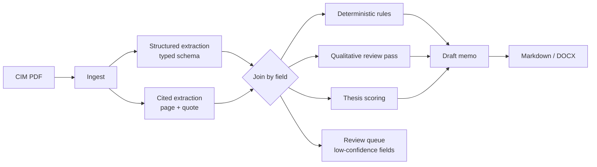

# CIM → IC Memo

**Turns a Confidential Information Memorandum into a sourced investment committee screening memo, where every financial figure links back to the page it came from.**

---

## The problem

In middle-market private equity — especially services rollups doing many small add-on acquisitions — diligence cost per deal does not scale down. A $3M-revenue bolt-on absorbs nearly the same analyst, legal and quality-of-earnings lift as a $30M platform. That fixed cost is what caps add-on velocity, not deal availability.

The highest-volume, lowest-judgment work in that funnel is always the same: read an 80-page CIM, extract the financial profile, normalize adjusted EBITDA, flag the obvious problems, draft the screening memo. Days of analyst time, spent mostly on deals that die.

This tool does that first pass so an analyst starts from a drafted, sourced memo instead of a blank page.

**It does not make investment decisions.** It produces a first draft and is explicit about what a human still has to verify.

---

## Pipeline



Extraction runs as **two passes** because the Claude API rejects `citations` and `output_config.format` on the same request. The structured pass gets schema-validated values; the cited pass locates the source passage. They are joined by field name, and where they disagree the structured value wins, confidence is downgraded, and the conflict is recorded so it surfaces in the review queue rather than being silently resolved.

---

## What makes this different from a PDF chatbot

**1. Provenance on every number.** Each extracted figure carries its source page and the verbatim quote, using the Claude API's native PDF citations. A figure that cannot be cited is never rendered as an established fact — it is marked `[uncited — pending review]` and routed to a human. `Cited[T]` makes an uncited number *unrepresentable* in the type system rather than merely discouraged.

**2. Confidence and human-in-the-loop.** Every field carries `high`/`medium`/`low`. Anything below `high` lands in a review queue showing the value, the source passage, and the reason it was flagged — a disagreement between passes, an ambiguous range, or a missing citation.

**2b. A health signal for silent degradation.** The most dangerous failure for a diligence tool is not a crash — it is a memo that renders normally with no provenance behind any number, because the citation pass drifted format and the parser matched nothing. `ExtractionHealth` measures citation rate over *citable* fields and puts a red banner on the memo, both exports and the UI when it collapses. Tested by feeding the pipeline a citation pass that returns prose.

**3. An eval harness with co-located ground truth.** The synthetic CIM generator emits the PDF and its ground-truth labels in the same pass, so labels cannot drift from the documents they describe. `make eval` scores extraction field-by-field.

**4. Cost and latency instrumentation.** Every run records per-stage tokens, cache hits, latency and USD. The memo footer says what it cost.

**5. Thesis-driven scoring.** Screening criteria live in YAML, not code. Two ship (`services_rollup`, `software_buyout`); the same engine scores both, and a test asserts the same company scores differently under each.

---

## Rules vs. model — a deliberate split

| | Deterministic rules | Qualitative pass |
|---|---|---|
| Owns | Concentration thresholds, addback ratios, margin/DSO trends, CAGR | Cross-section contradictions, contract structure, key-person risk, disclosure gaps |
| Can hallucinate | No | Yes — findings are marked and separated |
| Reproducible | Yes, with an inspectable threshold | Not exactly |

The memo renders them in separate blocks. A reviewer can see at a glance which findings are arithmetic and which are judgment. The qualitative prompt explicitly tells the model the arithmetic checks are already covered, so it spends effort on reading rather than recomputing ratios Python does better.

**The case this exists for:** BrightPath's executive summary (p.3) claims a "diversified payor base" while the customer table (p.11) shows a single payor at 34.6%. No keyword search finds that; it requires reading two sections against each other.

---

## Sample corpus

Five tech-enabled-services rollup targets, 21 pages each, generated with planted defects that double as eval ground truth:

| Company | Sector | Planted defect |
|---|---|---|
| Meridian Mechanical | Commercial HVAC | *(clean — control case)* |
| BrightPath Dental | Dental DSO | 34.6% payor concentration contradicting p.3; growth inorganic across 7 acquisitions |
| Northgate Technology | Managed IT | Addbacks 37.6% of adj. EBITDA; three "one-time" items recurring all three years |
| Verdant Grounds | Landscaping | DSO 38 → 67 days; seasonality understated vs. the quarterly table |
| Atlas Financial | Outsourced accounting | Founder departing with all top-five relationships; no change-of-control clauses |

```bash
make cims   # regenerate PDFs + ground truth
```

---

## Quickstart

```bash
git clone <this-repo> && cd PE-Workflow-Automatioon
make install
cp .env.example .env          # add your ANTHROPIC_API_KEY
make demo                     # generate CIMs, screen one, write the memo
make serve                    # http://localhost:8000
```

| Command | Does |
|---|---|
| `make demo` | Screen a sample CIM, write `data/memos/<name>.md` |
| `make serve` | Web UI — upload, review queue, exports |
| `make eval` | Score extraction against ground truth *(makes API calls)* |
| `make sweep` | Effort sweep — accuracy vs. cost per level *(makes API calls)* |
| `make test` | Full suite, mocked API, no key needed |
| `make lint` / `make typecheck` | ruff + mypy |

---

## Results

**Test suite:** 118 tests, no API key required, covering the two-pass join, confidence policy, every rule, thesis scoring, memo rendering, the web layer, parser robustness against model format drift, and input safety.

**Eval scorecard:** `make eval` produces per-document accuracy, coverage, citation rate, and red-flag recall/precision.

> **Not yet run against the live API.** The build environment had no API key, so the numbers below are unpopulated. Everything up to the API boundary is verified against a mocked client; the eval figures are the one thing that needs a key to produce. Run `make eval` and paste the scorecard here.

```
Document                     Acc     Cov   Cited   Correct   Wrong  Missed      Cost
------------------------------------------------------------------------------------
meridian_hvac                  —       —       —         —       —       —         —
brightpath_dental              —       —       —         —       —       —         —
northgate_msp                  —       —       —         —       —       —         —
verdant_landscaping            —       —       —         —       —       —         —
atlas_bookkeeping              —       —       —         —       —       —         —
```

Accuracy and coverage are reported separately on purpose: a field the tool declines to extract is scored as a *miss*, not an error. For a diligence tool, "not found" is correct behavior where inventing a number is not, and collapsing both into one accuracy figure would hide exactly the distinction that matters.

**Cost:** instrumented per stage and reported per run in the memo footer. The CIM document block is prompt-cached across all four stages, so `cache_read_tokens` should dominate after the first call — a zero there across a run means something is invalidating the prefix.

---

## What this doesn't do

- **Not a substitute for diligence.** It drafts a screening memo and tells you what to check. It does not verify anything.
- **Synthetic data only.** The corpus is generated. It has not been tuned against real CIMs, which are messier, longer, and worse-formatted.
- **No scanned PDFs.** Ingest rejects image-only documents rather than silently producing an empty profile. OCR is not wired in.
- **Not tuned on deal outcomes.** Thresholds are reasonable screening defaults, not empirically calibrated against what actually predicts returns.
- **Single-document.** No cross-portfolio comparison, no market data, no benchmarking against comparable transactions.
- **The qualitative pass can hallucinate.** That is why its findings are visually separated from rule findings and marked "verify before relying on."

---

## Design notes

**Why prompts are files, not strings.** `app/llm/prompts/*.md` are the highest-churn artifact in the system. In files, their diffs are readable in review; inline, prompt changes hide inside code changes.

**Why the recommendation is computed, not generated.** `draft.decide()` derives ADVANCE / MORE INFO / PASS from dealbreakers, high-severity flag count, and coverage. A screening call that depends on a model's mood is not one you can defend in an IC meeting. The model writes the prose; the determination is deterministic.

**Why coverage gates the score.** A 90% thesis score computed from three of nine criteria is noise. Below 50% coverage the tool returns MORE INFO regardless of score.

**Why runs are stored as JSON.** The schema is Pydantic-owned and still moving. A normalized store would mean a migration per field for no query benefit at this scale. Columns exist only for what the run list sorts and filters on.

**Effort as the cost lever.** All stages run on the same model; what varies is `output_config.effort` (`config.py: STAGE_EFFORT`). Swapping stages to a cheaper model to save cost trades quality invisibly; effort makes the tradeoff explicit and tunable. `make sweep` measures it rather than asserting it.

**Parsers assume the model will drift.** The citation and findings passes need a delimited text format (structured outputs can't be combined with citations), and models bold labels, renumber lists, and answer "n/a" where the prompt asked for a sentinel. Every one of those was a silent-failure mode found by adversarial probing, and each is now a regression test in `tests/test_robustness.py`. A parser that misses a line does not error — it quietly produces an unsourced memo, which is the one output this tool must never emit.

---

## Layout

```
app/
  models/       Pydantic schemas — Cited[T], DealProfile, RedFlag, Memo
  pipeline/     ingest → extract (2-pass join) → draft → orchestrator
  analysis/     rules.py (deterministic) · llm_flags.py (qualitative) · scoring.py
  llm/          SDK wrapper (caching, telemetry, typed errors) + prompts/
  export/       markdown.py · docx.py
  web/          Jinja templates, HTMX, no build step
config/thesis/  services_rollup.yaml · software_buyout.yaml
scripts/        generate_cims.py (PDFs + ground truth) · run_demo.py
evals/          run_evals.py · ground_truth/
tests/          118 tests, API mocked
```

---

*Built as a portfolio project. Synthetic data throughout; not investment advice.*
